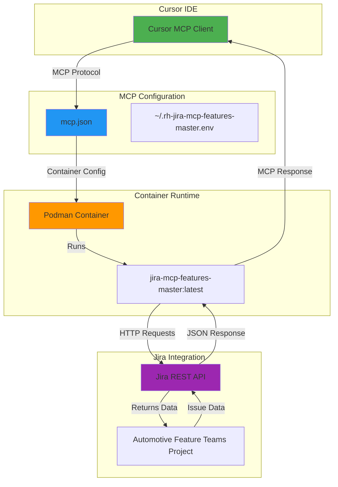
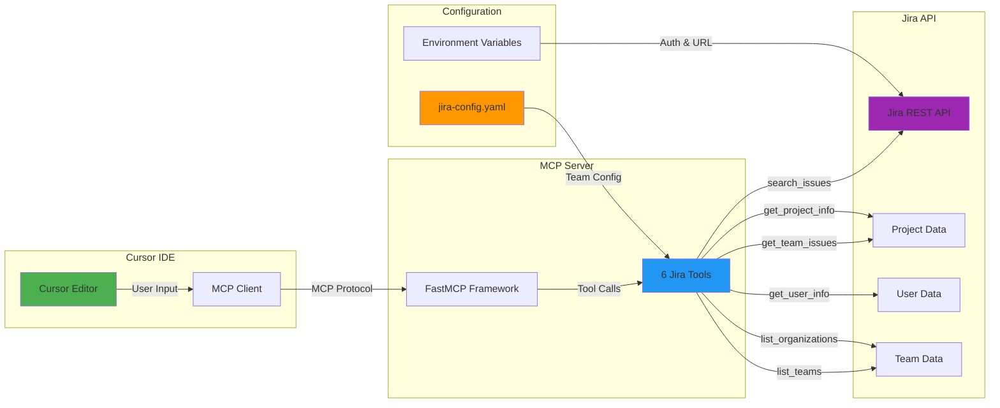

# Jira MCP Server

A streamlined Model Context Protocol (MCP) server for Jira integration that provides 6 essential tools for querying and managing Jira issues directly from Cursor.

## 🏗️ Architecture



## 🛠️ Tools & Connections



## 🚀 Quick Start

### Prerequisites
- Podman installed and running
- Jira API access token
- Cursor IDE with MCP support

### 1. Build the Container
```bash
make build
```

### 2. Configure Environment
Create `~/.rh-jira-mcp-features-master.env`:
```bash
JIRA_URL=https://your-jira-instance.com
JIRA_API_TOKEN=your-api-token
```

### 3. Configure Cursor MCP
Add to your `~/.cursor/mcp.json`:
```json
{
  "mcpServers": {
    "jiraMcp": {
      "command": "podman",
      "args": [
        "run",
        "-i",
        "--rm",
        "--env-file",
        "~/.rh-jira-mcp-features-master.env",
        "localhost/jira-mcp-features-master:latest"
      ],
      "description": "A containerized MCP server to query Jira issues"
    }
  }
}
```

## 📋 Available Tools

### 1. `search_issues(jql, max_results)`
Search Jira issues using any JQL query.

**Parameters:**
- `jql` (string): JQL query string
- `max_results` (int, optional): Maximum number of results (default: 20)

**Example:**
```python
search_issues('project = "Automotive Feature Teams" AND priority = "Critical"')
```

### 2. `get_team_issues(team, status, organization)`
Get issues for a specific team with optional organization filtering.

**Parameters:**
- `team` (string): Team name (e.g., "toolchain", "assessment")
- `status` (string, optional): Issue status (default: "In Progress")
- `organization` (string, optional): Organization filter (e.g., "SP")

**Examples:**
```python
# All toolchain tickets
get_team_issues("toolchain", "In Progress")

# SP toolchain tickets only
get_team_issues("toolchain", "In Progress", "SP")
```

### 3. `get_project_info(project_key)`
Get basic project information.

**Parameters:**
- `project_key` (string): Project key (e.g., "VROOM")

### 4. `get_user_info(username)`
Get user information.

**Parameters:**
- `username` (string): Jira username

### 5. `list_teams()`
List all configured teams.

### 6. `list_organizations()`
List all configured organizations.

## ⚙️ Configuration

### Teams Configuration (`jira-config.yaml`)
```yaml
teams:
  toolchain:
    name: "ToolChain Team"
    project: "Automotive Feature Teams"
    assigned_team: "rhivos-ft-auto-toolchain"
    members:
      - "Sameera Kalgudi"    # Display names work!
      - "Ozan Unsal"
      - "Marcel Banas"

  assessment:
    name: "Assessment Team"
    project: "Automotive Feature Teams"
    assigned_team: "rhivos-ft-auto-assessment"
    members:
      - "Joe Simmons-Talbott"
```

### Organizations Configuration
```yaml
organizations:
  SP:
    - "Sameera Kalgudi"      # Display names work!
    - "Ozan Unsal"
    - "Marcel Banas"
```

### Custom Display Names
The `user_display_names` section allows you to override Jira's display names with custom ones:

```yaml
user_display_names:
  rhn-support-skalgudi: "Sameera Kalgudi"
  rhn-support-ounsal: "Ozan Unsal"
  mabanas@redhat.com: "Marcel Banas"
  rhn-support-nsaini: "Nisha Saini"
  rsmit106: "Ryan Smith"
  jonderka@redhat.com: "Jan Onderka"
  rhn-support-josimmon: "Joe Simmons-Talbott"
```

**Benefits:**
- **Consistent Formatting**: Use preferred name formats
- **Privacy**: Mask real names with aliases if needed
- **Localization**: Provide localized name versions
- **Fallback**: If no custom name is defined, uses Jira's display name
- **Flexible Configuration**: Use display names in `members` sections - automatically resolves to usernames

## 🔧 Development

### Local Development
```bash
# Install dependencies
pip install -r requirements.txt

# Run locally
python server.py
```

### Container Development
```bash
# Build container
make build

# Run container
make run

# Clean up
make clean
```

## 📊 Usage Examples

### Get Critical Issues
```python
search_issues('project = "Automotive Feature Teams" AND priority = "Critical"')
```

### Get Team Backlog
```python
get_team_issues("toolchain", "To Do")
```

### Get Organization Issues
```python
get_team_issues("toolchain", "In Progress", "SP")
```

### Search by Assignee
```python
search_issues('assignee = "mabanas@redhat.com" AND statusCategory = "In Progress"')
```

## 🏆 Key Benefits

- **Simplified**: 6 core tools instead of 38
- **Fast**: Minimal overhead, optimized queries
- **Flexible**: Supports both team and organization filtering
- **Maintainable**: Clean code structure, easy to extend
- **Containerized**: Consistent deployment across environments
- **Secure**: Environment-based configuration

## 🔍 Troubleshooting

### Common Issues

1. **Container not found**
   ```bash
   make build
   ```

2. **Authentication failed**
   - Check `~/.rh-jira-mcp-features-master.env`
   - Verify JIRA_URL and JIRA_API_TOKEN

3. **Tools not available**
   - Restart Cursor after MCP configuration changes
   - Check MCP server status in Cursor settings

### Debug Mode
```bash
# Run with debug logging
python server.py --debug
```

## 📝 License

This project is licensed under the MIT License - see the [LICENSE](LICENSE) file for details.

## 🤝 Contributing

1. Fork the repository
2. Create a feature branch
3. Make your changes
4. Add tests if applicable
5. Submit a pull request

## 📞 Support

For issues and questions:
- Check the troubleshooting section
- Review the configuration examples
- Open an issue on GitHub 